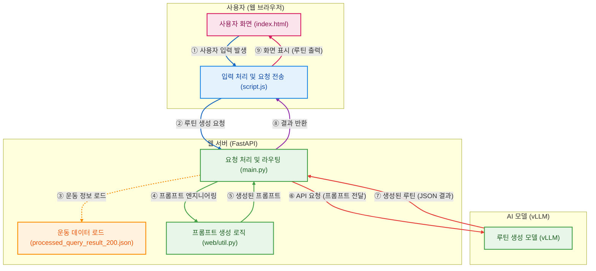

# Weekly Routine AI

이 문서는 Weekly Routine AI 프로젝트에 대한 개요, 실행 방법 및 파일 구조를 설명합니다.

## 프로젝트 개요

Weekly Routine AI는 사용자의 정보(성별, 레벨, 운동 빈도 등)를 기반으로 개인화된 주간 운동 루틴을 생성하는 AI 기반 웹 애플리케이션입니다.

## 아키텍처 흐름도


## 실행 방법

1. **필요한 패키지를 설치합니다.**
   ```bash
   pip install -r requirements.txt
   ```

2. **Uvicorn을 사용하여 웹 서버를 실행합니다.**
   ```bash
   uvicorn web.main:app --host 127.0.0.1 --port 5001 --reload
   ```

3. **웹 브라우저에서 `http://127.0.0.1:5001`로 접속합니다.**

--- 
## 📁 파일 구조

### 최상위 디렉토리
- **.gitignore** – Git 제외 대상 목록  
- **README.md** – 프로젝트 개요 및 구조 설명  
- **requirements.txt** – 필요 패키지 목록  
- **style.css** – 기본 스타일 정의  

---

### data
- 데이터 저장 디렉토리  

---

### src

#### analysis
- `analyze_output_length_full.py` – 출력 길이 분석  
- `calculate_frequency_improved.py` – 빈도 계산(개선 버전)

#### data_processing
- `transform_ai_exercise_list.py` – AI 운동 목록 변환  
- `update_ai_exercise_list_e_info_type.py` – 운동 정보 유형 업데이트  
- `update_filtered_exercises.py` – 필터링된 운동 목록 갱신  

#### finetuning
- `create_finetuning_data_v5.py` – 파인튜닝 데이터 v5 생성  
- `train.py` – 모델 학습 스크립트  

#### learning_script
- `calculation_prompt.py` – 계산 프롬프트 생성  
- `history_summary.py` – 기록 요약  
- `integrated_prompt_generator.py` – 통합 프롬프트 생성기  
- `output_json.py` – JSON 출력 처리  
- `user_info.py` – 사용자 정보 처리  

---

### web
- **allowed_name_200.json** – 허용 운동 200개 목록  
- **index.html** – 메인 페이지  
- **main.py** – FastAPI 백엔드  
- **prompts.py** – 웹 프롬프트 정의  
- **script.js** – 프론트엔드 로직  
- **style.css** – 스타일 정의  
- **util.py** – 유틸리티 함수  
- **ratios/**  
  - `F_ratio_weight.json` – 여성 비율 가중치 데이터  
  - `M_ratio_weight.json` – 남성 비율 가중치 데이터  

    